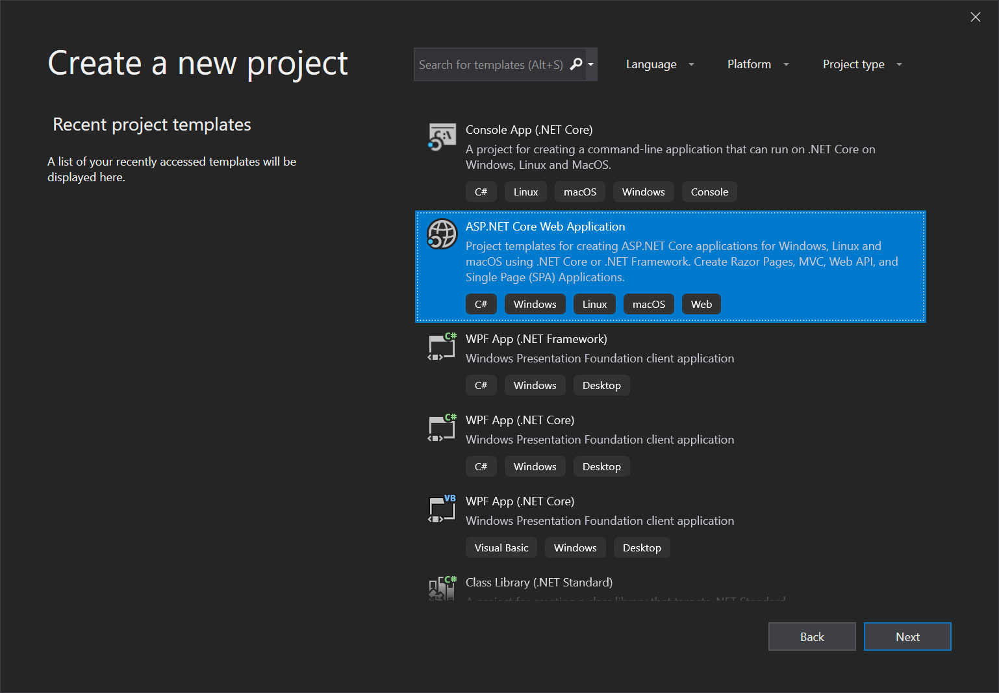
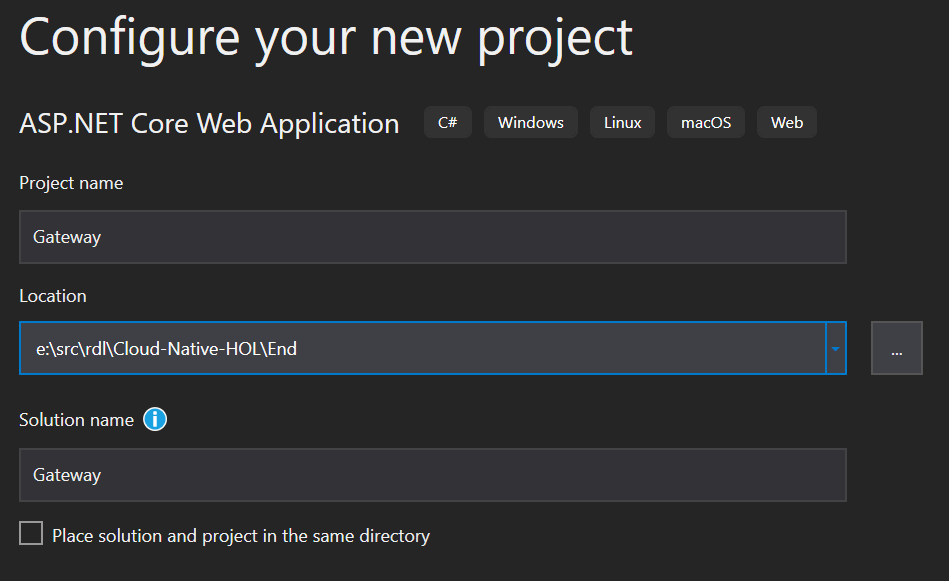
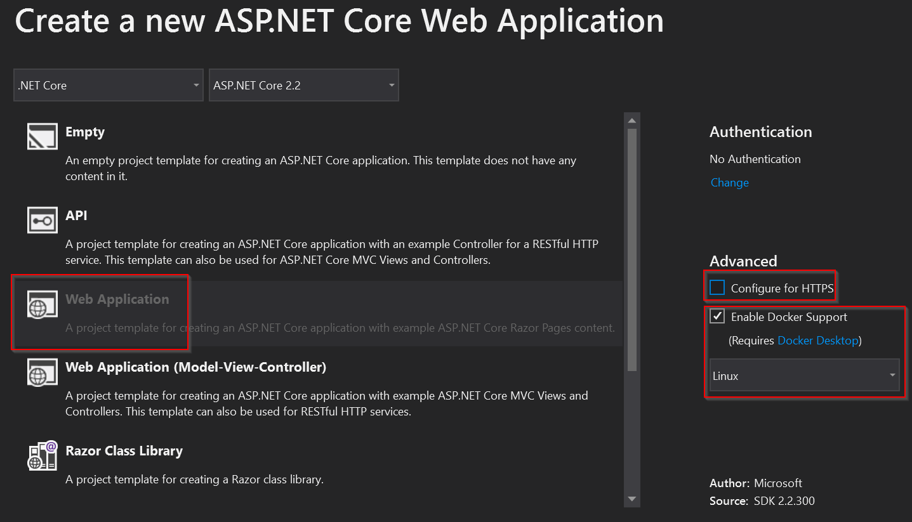
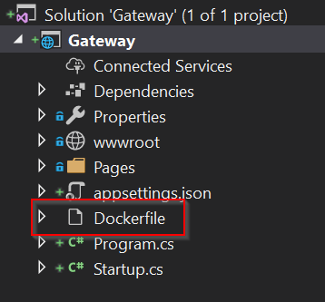
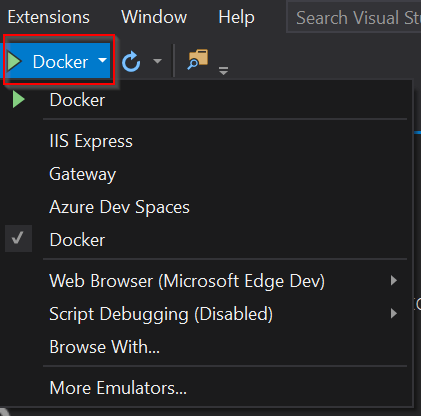
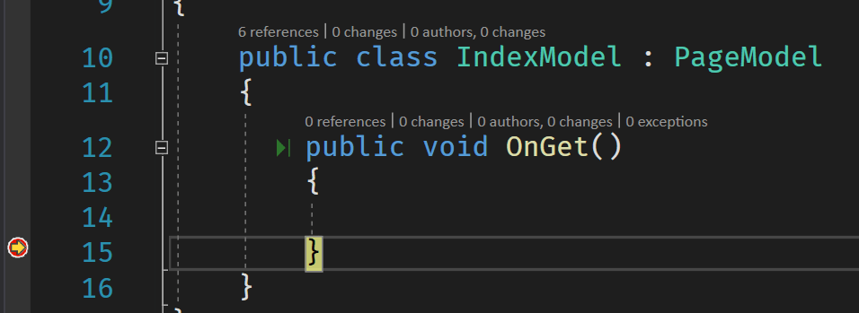
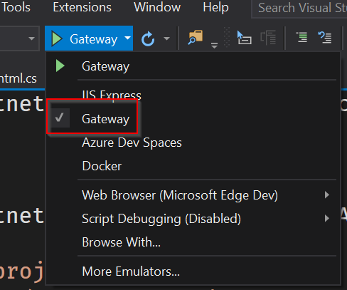

# Build and Deploy ASP.NET Core to Docker

In this lab we'll create an ASP.NET Core website that is hosted in a Docker container, and push that container image to a remote repository so it runs in Azure.

Lesson goals:
1. Learn how to create a container-based ASP.NET Core website
1. Learn how to run a Docker container locally
1. Learn how to debug software in a Docker container
1. Learn how to push a local container image to a remote repository
1. Learn how to deploy a container image to an Azure App Service
 
## Create Website
1. Open Visual Studio
1. Create new ASP.NET Core project named `Gateway`   
   1. Use the *Web Application* template
   1. Uncheck the *Configure for HTTPS* option (to simplify for demo/lab purposes)
   1. Check the *Enable Docker Support* option
   1. Confirm the use of Linux containers
1. Look at Solution Explorer 
   1. Notice how it is a normal ASP.NET Core Razor Pages project
   1. *Except* for `Dockerfile`
1. Look at the run/debug options in the VS toolbar 
   1. Notice it defaults to *Docker*
   1. You can still switch to *IIS Express* if desired
1. Press *F5* to debug
   1. The app should build and run "as normal"
1. Look at the Build Output window 
   1. Notice how the build output looks very different
      1. The project didn't build from VS
      1. VS ran a `docker run` command
      1. The result is a container being created based on `Dockerfile`
      1. The web page in the browser is hosted by ASP.NET Core *in a Linux container*
1. The VS debugger is attached to the code running in the container
   1. Open the `Index.cshtml.cs` file
   1. Set a breakpoint on the close brace of `OnGet`
   1. Refresh the page in the browser
   1. Notice now the breakpoint is hit as the Index page is reloaded 

## Understanding Dockerfile
Open `Dockerfile` in Visual Studio.

This file defines how the container will be created. In fact, it defines not only the *final* container, but also intermediate containers that'll be used to build our .NET project on Linux.

### Base Image
The first code block defines the "base image" to be used when creating the final container.

```
FROM mcr.microsoft.com/dotnet/core/aspnet:2.2-stretch-slim AS base
WORKDIR /app
EXPOSE 80
```

The base image is typically provided by a vendor or your IT group. In this case it is a Microsoft-supplied image based on Linux, with the ASP.NET Core runtime already installed. Microsoft works hard to minimize the size of this base image.

The `WORKDIR` specifies a directory inside the image where our files will go. This is basically like a `cd` command.

The `EXPOSE` statement indicates that this image will listen on port 80.

### Build the Project
The next code block defines an "intermediate image" used to build the ASP.NET Core project. This intermediate image only exists long enough to do the build, and then it is discarded. It isn't part of the final image, and isn't deployed.

```
FROM mcr.microsoft.com/dotnet/core/sdk:2.2-stretch AS build
WORKDIR /src
COPY ["Gateway/Gateway.csproj", "Gateway/"]
RUN dotnet restore "Gateway/Gateway.csproj"
COPY . .
WORKDIR "/src/Gateway"
RUN dotnet build "Gateway.csproj" -c Release -o /app
```

Notice how this image uses a different base image. This base image is also from Microsoft, but includes the dotnet SDK, not just the runtime. It is *much* larger, because it includes the compilers and other SDK tools/components necessary to build dotnet apps.

In this case the `WORKDIR` is set to `/src` and our *local* `csproj` file is copied into the container. The `dotnet restore` command is run to restore NuGet packages, then the rest of our *local* source files are copied into the container.

Finally a `dotnet build` command is run to build the project.

If you've worked with the `dotnet` command line tool at all, this process should seem somewhat familiar, as when building a project on the command line you will often do `dotnet restore` and `dotnet build` just like what's happening here in the container.

The reason the build occurs *inside the container* is so that the restore, build, compile processes all run within Linux, so the resulting compiled output is compiled *for Linux*.

### Publish the Project
The next code block defines another intermediate image used to publish the results of the previous build step. In this case the new image is based on the previous imtermediate image. That means this new image starts with everything that was already in the previous image, including the `/app` directory that contains the build output.

```
FROM build AS publish
RUN dotnet publish "Gateway.csproj" -c Release -o /app
```

The `dotnet publish` command is executed to create publish output based on the code built in the previous step. The result is the same publish output you'd get if you manually ran a `dotnet publish` command, or did a Publish from Visual Studio. 

### Create the Final Image
The last code block creates the final image.

```
FROM base AS final
WORKDIR /app
COPY --from=publish /app .
ENTRYPOINT ["dotnet", "Gateway.dll"]
```

Notice how this starts by using the original base image defined at the top of the file: `base`. This is used to create the final image, named `final`. 

This step runs within the context of the previous intermediate container, so we still have access to the `/app` directory that contains the output from `dotnet publish`.

The results of the publish step are copied into this new image's `/app` directory. This might be confusing, but what's happening here is that we're taking only the `dotnet publish` output and copying it from the intermediate image to this final image. None of the `/src` or dotnet SDK or anything else from the intermediate images will carry forward.

In short, the `final` image contains
1. Linux
1. The ASP.NET Core runtime (not SDK)
1. The output from the `dotnet publish` step (our app)

The last line is `ENTRYPOINT`, which specifies the command that Docker should execute when this image is loaded as a container. Basically this says that on startup, run `dotnet Gateway.dll`.

You can try this in VS too. Notice that one of the startup options for run/debug in Visual Studio is Gateway. 

If you select this option and press *ctl-F5* (or *F5*) you'll see that VS opens a console window, runs `dotnet Gateway.dll`, and that becomes a self-hosted web server for your app.

That's exactly what's happening inside this final docker image. When it runs as a container, the CLI command `dotnet Gateway.dll` is executed, causing your app to run as a self-hosted web server.

## Docker Images and Containers
Now that you've run some things via Docker, you can view the image files on your workstation. Type `docker image ls` to get a list. That list should include these items:

```
$ docker image ls
REPOSITORY                                 TAG                      IMAGE ID            CREATED             SIZE
gateway                                    dev                      6c6a43d12ad4        About an hour ago   260MB
mcr.microsoft.com/dotnet/core/aspnet       2.2-stretch-slim         fe1db87517ca        5 hours ago         260MB
hello-world                                latest                   4ab4c602aa5e        10 months ago       1.84kB
```

There may be others as well, but from Lab00 you should have the `hello-world` image, plus the Microsoft ASP.NET Core base image, plus the newly created `gateway` image.

Images are just files. When an image is *running* it runs within a container. You can see the containers running on your workstation by typing `docker ps`. The result should be something like this:

```
$ docker ps
CONTAINER ID        IMAGE               COMMAND               CREATED             STATUS              PORTS                   NAMES
bef043ed046c        gateway:dev         "tail -f /dev/null"   About an hour ago   Up About an hour    0.0.0.0:57786->80/tcp   tender_panini
```

This container is hosting the gateway web server. 

Notice the port mapping: `0.0.0.0:57786->80/tcp`. This indicates that port 80 from *inside* the container is being mapped to our workstation's port 57786. 