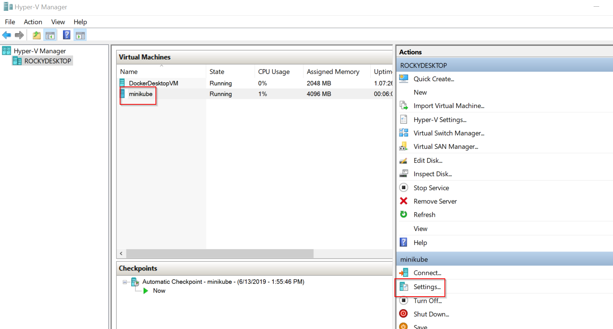
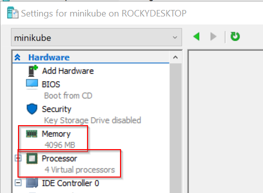

# Deploy pre-built software into Kubernetes

In this lab we'll install RabbitMQ into K8s using Helm, and then we'll use `kubectl` to deploy the Gateway web site into K8s.

Lesson goals:

1. Create ACR credentials so Kubernetes can pull images
1. Use `kubectl` to deploy ASP.NET Core website
1. Increase minikube resources

## Deploy Website to Kubernetes

In this section of the lab you'll build a Docker image, create a definition file to deploy that image to Kuberentes, create a definition file to expose that image as a service, and then execute those definition files against minikube.

### Build Docker image

1. Open a CLI window
1. Change directory to src/Lab02/Start/Gateway
1. Build the image `docker build -t gateway:lab02 -f Gateway/Dockerfile .`
1. Type `docker image ls` and you should see your new `gateway:lab02` image

Now push the image to your Azure repository (replacing 'myrepository' with your repository name)

1. Label the image: `docker tag gateway:lab02 myrepository.azurecr.io/lab02/gateway:lab02`
1. Push the image: `docker push myrepository.azurecr.io/lab02/gateway:lab02`
1. Confirm: `az acr repository list -n MyRepository`

The result should be that your new image is visible in the Azure repository, similar to the experience in Lab01.

### Create Deployment definition

Create a new `deploy.yaml` file in your src/Lab02/Start/Gateway directory. It is recommended to use VS Code for this purpose, as this editor supports an extension that provides Intellisense for yaml files.

Add the following to this new file:

```yaml
apiVersion: apps/v1
kind: Deployment
metadata:
  name: gateway
spec:
  selector:
    matchLabels:
      app: gateway
  replicas: 1
  strategy:
    rollingUpdate:
      maxSurge: 1
      maxUnavailable: 1
  minReadySeconds: 5
  template:
    metadata:
      labels:
        app: gateway
    spec:
      containers:
      - name: gateway
        image: myrepository.azurecr.io/lab02/gateway:lab02
        resources:
          limits:
            memory: "128Mi"
            cpu: "500m"
```

This defines a Kubernetes _deployment_, describing the desired end state for deploying your image to a K8s cluster. Notice that it specifies the container image, how many replicas (instances) should be running, a rolling update strategy, runtime resource limits, and runtime environment variables.

### Create Service definition

Create a new `service.yaml` file in your src/Lab02/Start/Gateway directory.

> ℹ You can optionally append this content to your existing `deploy.yaml` file, but for learning purposes it is best to keep these concepts separate.

```yaml
apiVersion: v1
kind: Service
metadata:
  name: gateway
spec:
  type: LoadBalancer
  ports:
  - port: 80
  selector:
    app: gateway
```

This defines a Kubernetes _service endpoint_ for your deployment. Notice that it specifies the use of a `LoadBalancer` on port `80` for the `gateway` deployment.

Not all deployments need a service definition, but if your deployment needs an IP address that can be used by other containers in your K8s cluster, or from outside the K8s cluster, then you need to define a service.

### Deploy image and service

Now that you have deployment and service definitions, you can use the `kubectl` command to apply those definitions to your Kuberentes cluster.

#### Set up permissions to ACR from minikube

Before you can have minikube (or any K8s cluster) pull images from your Azure repository you need to provide the K8s cluster with the credentials to the repository. 

In Lab01 you did something similar by providing ACR credentials to the Azure App Service so it could pull your container image from ACR.

To do this for Kubernetes you use the `kubectl` command to create a secret that contains the credentials, and then provide the name of that secret in the `deploy.yaml` file.

As in Lab01, the admin credentials can be retrieved using the following command line (or via the web portal):

```text
az acr credential show -n MyRepository
```

Now use those values to enter the following `kubectl` command. Make sure to use a local CLI window that is connected to your minikube.

```bash
kubectl create secret docker-registry acr-auth --docker-server myrepository.azurecr.io --docker-username <principal-id> --docker-password <principal-pw> --docker-email <your@email.com>
```

> ⚠ Make sure to replace "myrepository", "\<principal-id\>", "\<principal-pw\>", and "\<your\@email.com\>" with your real values.

That'll create a secret in minikube named `acr-auth` that contains read-only credentials for your Azure repository.

Now edit the `src/Lab02/Start/Gateway/deploy.yaml` file and add

```yaml
      imagePullSecrets:
      - name: acr-auth
```

The final file should look like this:

```yaml
apiVersion: apps/v1
kind: Deployment
metadata:
  name: gateway
spec:
  selector:
    matchLabels:
      app: gateway
  replicas: 1
  strategy:
    rollingUpdate:
      maxSurge: 1
      maxUnavailable: 1
  minReadySeconds: 5
  template:
    metadata:
      labels:
        app: gateway
    spec:
      containers:
      - name: gateway
        image: myrepository.azurecr.io/lab02/gateway:lab02
        resources:
          limits:
            memory: "128Mi"
            cpu: "500m"
      imagePullSecrets:
      - name: acr-auth
```

minikube (the Kubernetes cluster) has a secret named `acr-auth`, and the container spec references that secret. This will allow minikube to successfully pull the container image from the Azure repository when you deploy your image.

#### Deploy image

`kubectl` uses a _desired state_ philosophy. This is to say that your yaml files describe the desired state for your configuration, and when you apply those files the tooling will attempt to change the current state of the K8s cluster to match your desired state.

Right now the `gateway` deployment and service don't exist, so on first run `kubectl` will change the current state to match the state described in your yaml files.

In a CLI window, change directory to `src/Lab02/Start/Gateway` and type these commands:

```text
kubectl apply -f deploy.yaml
kubectl apply -f service.yaml
```

You can apply those same files to the cluster multiple times, but subsequent calls won't do anything because the current state will already match the desired state.

You can list the deployment and service with commands such as:

```text
$ kubectl get deployments
NAME      READY   UP-TO-DATE   AVAILABLE   AGE
gateway   0/1     1            0           6m48s

$ kubectl get services
NAME         TYPE           CLUSTER-IP      EXTERNAL-IP   PORT(S)        AGE
gateway      LoadBalancer   10.106.70.116   <pending>     80:31149/TCP   48s
kubernetes   ClusterIP      10.96.0.1       <none>        443/TCP        46d
```

minikube won't assign an external IP for a service, so that value will always be pending. However, you can see that the service does have a cluster IP address so it is accessible to any pods running in the K8s cluster.

Of course we need access to the service from localhost, and fortunately minikube has a provision to enable that scenario.

1. Open a CLI window _as administrator_
1. Type `minikube dashboard`
   * This will show a dashboard so you can see what's running in the K8s cluster
   * This is often useful for diagnosing issues when things don't run as expected
1. Type `minikube service gateway --url`
   * This will show the localhost URL provided by minikube to access the service
1. Type `minikube service gateway`
   * This will open your default browser to the URL for the service - it is a shortcut provided by minikube for testing

> ⚠ An Admin CLI window (e.g. run as administrator) is required because interacting with the `minikube` command always needs elevated permissions.

### Change number of replicas

At this point you should have the `gateway` deployment and service working in minikube.

You can see that there is one instance (replica) of `gateway` running by typing:

```bash
$ kubectl get pods
NAME                       READY   STATUS    RESTARTS   AGE
gateway-76fb9cd568-6lr94   1/1     Running   0          53m
```

You can see that just one replica of the image is running at this time.

One of the advantages of Kubernetes is that you can easily spin up multiple instances (replicas) of a deployment.

In a production environment your K8s cluster will normally have multiple nodes, and K8s will attempt to balance the load of your replicas across all available nodes. With minikube there is only one node, but that doesn't stop us from spinning up multiple replicas of a deployment.

Edit the `deploy.yaml` file and edit the `replicas` value to a value of 2.

```yaml
  replicas: 2
```

This indicates that our new _desired state_ is to run 2 replicas instead of 1. Use `kubectl` to apply this desired state to the current state of the cluster:

```bash
kubectl apply -f deploy.yaml
```

At this point you can run `kubectl get pods` to see that two instances of the image are now running in the cluster. If you were fast enough typing `kubectl get pods` after applying the change you might even see the new pod in a non-running state as it downloads the image and spins up the instance.

Go ahead and explore changing the `replicas` value to 3 and then down to 1. Quickly get the list of pods after each change to see how K8s starts and stops the various pod instances.

## Cleanup

At the end of Lab02 it is important to do some basic cleanup to avoid conflicts with subsequent labs.

1. `kubectl delete deployment gateway`
1. `kubectl delete service gateway`

# Increase Minikube Resources

By default minikube is configured with very limited resources. And this is fine for simple things like Lab02. However, in subsequent labs more resources will be required.

If minikube doesn't have enough memory or CPU resources allocated it will fail to start up new pods as requested. This is a feature, because it protects already running pods by not allowing more pods to start if resources aren't available. But it is problematic when trying to run your code!

Using an _admin_ CLI, stop minikube:

1. In Git Bash
   * `winpty minikube ssh "sudo poweroff"`
1. In cmd or PowerShell
   * `minikube ssh "sudo poweroff"`

Open Hyper-V Manager from the Windows start menu, then open the settings for the minikube VM (which should not be running).



Change the memory to 4096 and the Virtual CPU count to 4.



With those changes saved, you can restart minikube from an _admin_ CLI:

1. In Git Bash
   * `winpty minikube start --vm-driver hyperv --hyperv-virtual-switch "Default Switch"`
1. In cmd or PowerShell
   * `minikube start --vm-driver hyperv --hyperv-virtual-switch "Default Switch"`

> ℹ There are command switches for `minikube start` to increase memory and CPU allocations. They only affect a Hyper-V VM _on the very first install/run of minikube_. Once the VM has been created you must set the memory and CPU allocations through Hyper-V Manager.

* `minikube start --vm-driver-hyperv --hyperv-virtual-switch "Default Switch" --memory 4096 --cpus 4`

This will provide enough resources to minikube to run the subsequent labs.

> ℹ If `--cpus 4` is not sufficient, and if your physical device has more virtual CPUs (via hyperthreading) you can set the value higher.

## References

* [Azure Container Registry authentication with service principals](https://docs.microsoft.com/en-us/azure/container-registry/container-registry-auth-service-principal)
